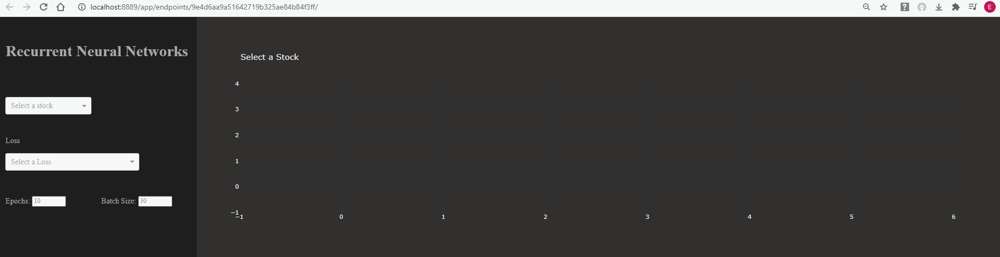

# Stock_Predictions_with_ML
Modeling predictions of closing prices for ETFs tracking S&P 500 and Gold using a Random Forest Algorithm and a Recurrent Neural Network

## Notes 
 Index ETFs used are:
 SPDR S&P 500 ETF, 
 SPDR GOLD ETF

APIs used:
  Alpha Vantage, 
  Yahoo Finance
 
 Models used:
  Random Forest VS RNN
  
  

